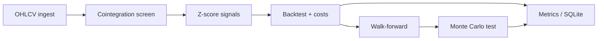

# Statistical Arbitrage Research & Backtesting Engine

Python research framework that screens equity pairs for **cointegration**, generates **z-score mean-reversion** signals, and validates them with **transaction costs**, **walk-forward out-of-sample testing**, and **Monte Carlo permutation significance tests**.

> Past performance does not imply future results. This is an educational / research tool, not trading advice.

## Why this exists

Most undergrad “stock prediction” projects report an accuracy number and stop. This project’s value proposition is the opposite: show that a candidate pairs strategy is (or is not) distinguishable from curve-fit noise — the skepticism a quant research desk applies daily.

## Architecture

```text
Data (yfinance → Parquet + SQLite)
        ↓
Cointegration screen (Engle–Granger)
        ↓
Z-score signal generation
        ↓
Vectorized pairs backtest (+ costs / slippage)
        ↓
Walk-forward OOS + Monte Carlo significance
        ↓
Results / optional Streamlit dashboard
```



## Quickstart

```bash
cd stat-arb-engine
python -m venv .venv
source .venv/bin/activate
pip install -e ".[dev]"

# 1) Download & cache universe
stat-arb ingest-data

# 2) Screen for cointegrated pairs
stat-arb screen-pairs
stat-arb list-pairs

# 3) Backtest one pair
stat-arb run-backtest --pair-id BAC_JPM

# 4) Walk-forward + significance
stat-arb run-walkforward --pair-id BAC_JPM
stat-arb run-significance-test --pair-id BAC_JPM
```

Optional dashboard:

```bash
pip install -e ".[dashboard]"
stat-arb launch-dashboard
```

## Configuration

All research knobs live in [`configs/default.yaml`](configs/default.yaml) (windows, z-thresholds, costs, walk-forward lengths, etc.). Universes are in [`configs/universes.yaml`](configs/universes.yaml).

## Core math (short)

**Cointegration (Engle–Granger).** Prices \(P^a_t, P^b_t\) are cointegrated if each is I(1) but the residual

\[
e_t = P^a_t - \hat\alpha - \hat\beta P^b_t
\]

is stationary (ADF / `statsmodels.coint` p-value below threshold).

**Signals.** Rolling z-score \(z_t = (S_t - \mu_t)/\sigma_t\) on the spread; enter when \(|z|\) exceeds `entry_z`, exit near zero or at a stop.

**Validation.** Hedge ratio estimated only on train windows; traded only on subsequent test windows. Monte Carlo shuffles net returns to get a p-value for the observed Sharpe under a “no timing skill” null.

A full internship-oriented study guide (definitions, interview Q&A, resume/ATS bullets)
lives in [`docs/STUDY_NOTES.md`](docs/STUDY_NOTES.md). Plain overview: [`docs/PROJECT_SUMMARY.md`](docs/PROJECT_SUMMARY.md). Technical report: [`docs/RESEARCH_REPORT.md`](docs/RESEARCH_REPORT.md).

### First QQQ run (snapshot)

- Universe: Nasdaq-100 / QQQ (~101 names; 94 with enough history)
- Screened: 4,371 pairs → 172 EG pass @5% → top 40 stored
- Example OOS: `DDOG_PANW` walk-forward Sharpe ≈ 0.15 (rf=2%); most pairs had **negative** cost-aware Sharpe
- Timing Monte Carlo (shuffle positions): signal beats random timing, but that ≠ economic edge

Read the study notes before interviewing — they are written for internship prep around statistical arbitrage, cointegration, mean reversion, and backtesting.


## Tests & CI

```bash
pytest -q
ruff check src tests
```

GitHub Actions runs lint + pytest on every push.

## Project layout

```text
stat-arb-engine/
├── src/
│   ├── pipeline/       # ingest + Parquet/SQLite
│   ├── screening/      # Engle–Granger pair screen
│   ├── signals/        # z-score state machine
│   ├── backtest/       # costs, equity, metrics
│   ├── validation/     # walk-forward + Monte Carlo
│   └── cli.py
├── tests/
├── configs/
├── dashboard/
├── docs/
└── .github/workflows/ci.yml
```

## Disclaimer

Educational research only. Not investment advice. Equity pairs trading involves shorting, borrow costs, and substantial model risk; transaction costs can eliminate apparent edge.
